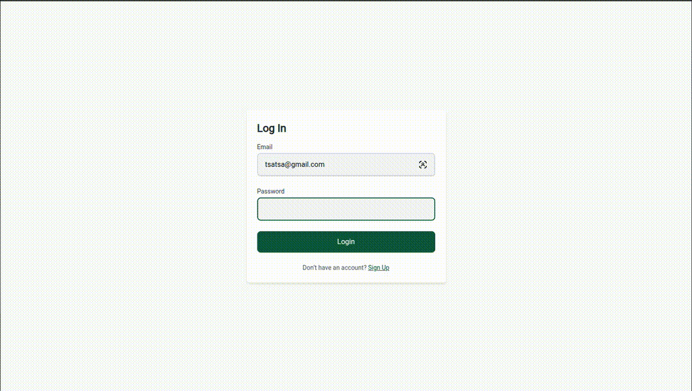

# 🚀 Agrohands

This project is designed for **viewing purposes only** and is protected under a **Proprietary License**. Unauthorized use, modification, or distribution is strictly prohibited.

## Overview



Agrohands is a full-stack application for managing workers, built with TypeScript, Express.js, React, CQRS, DDD, and MongoDB. The system is designed with ports ands adapters principles and is fully containerized using Docker.

## Installation

```bash
cd agrohands/backend
npm i
cd ../frontend
npm
cd ..
docker compose up --build
```

## ✨ Features

✔️ User authentication (Signup/Login with JWT)  
✔️ User change email or password  
✔️ Job postings with pagination and job creation form
✔️ Worker postings with pagination, search bar
✔️ Personal worker upsert functionalities and delete option
✔️ CQRS (Command Query Responsibility Segregation)  
✔️ Domain-Driven Design (DDD)
✔️ Result Pattern
✔️ Component-based architecture
✔️ MongoDB as the database  
✔️ Fully containerized with Docker

## 🛠️ Tech Stack

**Backend:**

- TypeScript
- Node.js
- Express.js
- MongoDB (with native MongoDB package)
- CQRS & DDD principles
- Result pattern

**Frontend:**

- React.js
- Tailwind Css
- React Router v7

**DevOps & Tools:**

- Docker
- ESLint & Prettier (code formatting)
